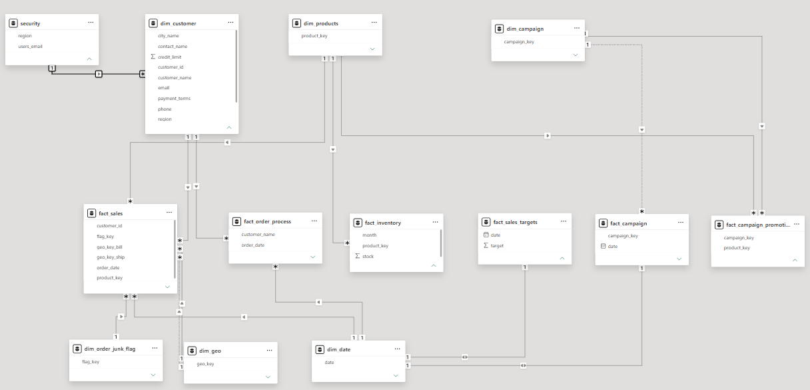

# Retail Data Modeling Project — Power BI

A star-schema data model built in Power BI covering sales, order fulfillment, inventory, marketing campaigns, and sales targets, with a dynamic calendar dimension and email-based row-level security (RLS).

---

## 📐 Data Architecture



| Type | Table | Purpose |
|------|-------|---------|
| Fact | `fact_sales` | Line-level sales transactions |
| Fact | `fact_order_process` | Order lifecycle tracking (order → invoice → delivery → payment) |
| Fact | `fact_inventory` | Monthly stock levels by product |
| Fact | `fact_campaign` | Marketing campaign performance |
| Fact | `fact_campaign_promotions` | Promotions linked to campaigns and products |
| Fact | `fact_sales_targets` | Sales targets for actual-vs-target analysis |
| Dim | `dim_customer` | Customer profile, credit limit, region, contact details |
| Dim | `dim_products` | Product catalog |
| Dim | `dim_geo` | Shared billing/shipping geography |
| Dim | `dim_date` | Calendar table with a Year → Quarter → Month → Day hierarchy |
| Dim | `dim_order_junk_flag` | Junk dimension consolidating low-cardinality order flags |
| Dim | `dim_campaign` | Campaign attributes |
| Security | `security` | User-to-region mapping, used exclusively for RLS |

**Grain:**
- `fact_sales` — one row per order line (`line_id`) with `customer_id`, `product_key`, `flag_key`, `geo_key_bill`, `geo_key_ship`, `order_date`
- `fact_order_process` — one row per order, tracking `order_date`, `invoice_date`, `delivery_date`, `pay_date`, `ship_date`
- `fact_campaign_promotions` — one row per campaign/product promotion pairing

---

## 🔄 ETL Design (Power Query)

Data flows through a **staging → transform → load** pipeline:

1. **Staging** — each source Excel workbook is loaded as an isolated query, kept structurally identical to the source so lineage stays traceable.
2. **Transform** — staging queries are merged (`Table.NestedJoin`) and appended into conformed dimensions and facts, with type enforcement, key derivation, and column pruning applied at this stage rather than in the destination tables.
3. **Load** — only the final, modeled dimension and fact tables are loaded into the report; staging queries are marked as connection-only to keep the model lean.

---

## 🗓️ Date Dimension & Hierarchy

- `dim_date` is a **DAX calculated table** (`CALENDARAUTO()`), decoupled from Power Query since it needs no external refresh and stays fully self-maintaining as the fact date range grows.
- Supporting `year`, `quarter`, `month`, and `day` columns feed a single **`Date Hierarchy`** exposed to report users; the underlying columns are hidden from the Fields pane so `dim_date` presents just `date` and the hierarchy.
- **Auto Date/Time** is disabled at the file level so Power BI's implicit per-column hierarchies don't compete with the explicit calendar table.
- Date-part columns are set to **no default summarization**, since they function as categorical hierarchy levels rather than additive numeric measures.

---

## 🔗 Relationship Model

| From (1) | To (*) | Join Key | Notes |
|----------|--------|----------|-------|
| `security` | `dim_customer` | `region` | Backs the RLS filter, not used for report navigation |
| `dim_customer` | `fact_sales`, `fact_order_process` | `customer_id` / `customer_name` | Standard one-to-many |
| `dim_products` | `fact_sales`, `fact_order_process`, `fact_inventory`, `fact_campaign_promotions` | `product_key` | Conformed across four fact tables |
| `dim_campaign` | `fact_campaign`, `fact_campaign_promotions`, `fact_sales_targets` | `campaign_key` | One relationship per fact kept **inactive** where a table already has a primary active date/campaign path |
| `dim_order_junk_flag` | `fact_sales` | `flag_key` | Consolidates low-cardinality order attributes into a single junk dimension |
| `dim_geo` | `fact_sales` | `geo_key_bill`, `geo_key_ship` | Role-playing dimension — one relationship active, the second inactive and invoked via `USERELATIONSHIP()` for ship-address analysis |
| `dim_date` | `fact_sales`, `fact_order_process`, `fact_inventory`, `fact_campaign`, `fact_campaign_promotions`, `fact_sales_targets` | `date` | Role-playing across every fact table's date column; each fact keeps one active relationship, with alternates activated in DAX where needed |

---

## 🔒 Row-Level Security (RLS)

RLS restricts each viewer to their assigned region using a dedicated mapping table rather than embedding logic in the fact tables:

```dax
dim_customer[region] = LOOKUPVALUE(
    security[region],
    security[users_email], USERPRINCIPALNAME()
)
```

`USERPRINCIPALNAME()` resolves the signed-in user's UPN, `LOOKUPVALUE` maps it to a region via `security`, and the resulting filter on `dim_customer[region]` propagates to every fact table through the relationships above.

For users who may need visibility into more than one region, the pattern extends to a set-based filter instead of a scalar lookup:

```dax
dim_customer[region] IN
    CALCULATETABLE(
        VALUES(security[region]),
        security[users_email] = USERPRINCIPALNAME()
    )
```

---

## 📁 Repo Structure

```
├── README.md
├── pbix/
│   └── datamodelling_final_project.pbix
├── staging-data/
│   └── raw_tables.xlsx
└── docs/
    └── model-diagram.png
```

---

*A personal project built to practice star-schema design, role-playing dimensions, calculated date tables, and row-level security in Power BI.*
